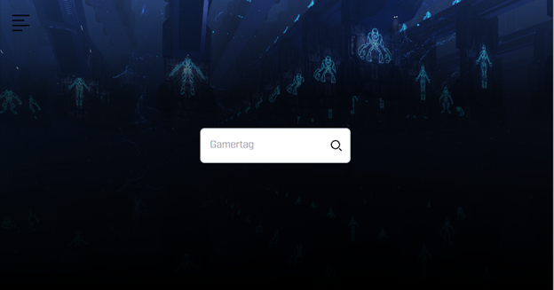
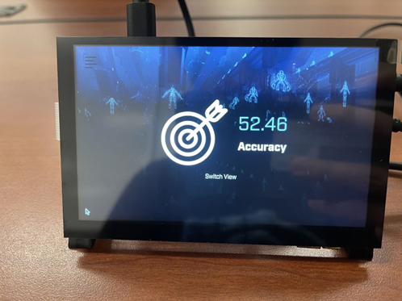

# PiStatTracker

PiStatTracker is a web application designed to enhance the gaming experience by providing real-time statistics on a Raspberry Pi with a touchscreen interface.




## Features
- **Real-Time Statistics**: Displays live game statistics.
- **User-Centric Display**: Engaging and interactive interface.
- **Mutli-View Options**: Single Stat and Dashboard views.
- **Customizable Settings**: Users can select specific metrics to display.

## Usage
1. Clone Repository
```bash
git clone https://github.com/cambatch/PiStatTracker.git
cd PiStatTracker
pip install -r requirements.txt
```

Setup environment variables for azure and player found in app/authentication/auth.py

```bash
flask run
```